# User manual

Newsku is fairly straight forward to use but here's how to get started

## Add feeds

Once you've created your account, go to the settings (top right icon on the screen) and add or import your preferred RSS
feeds.

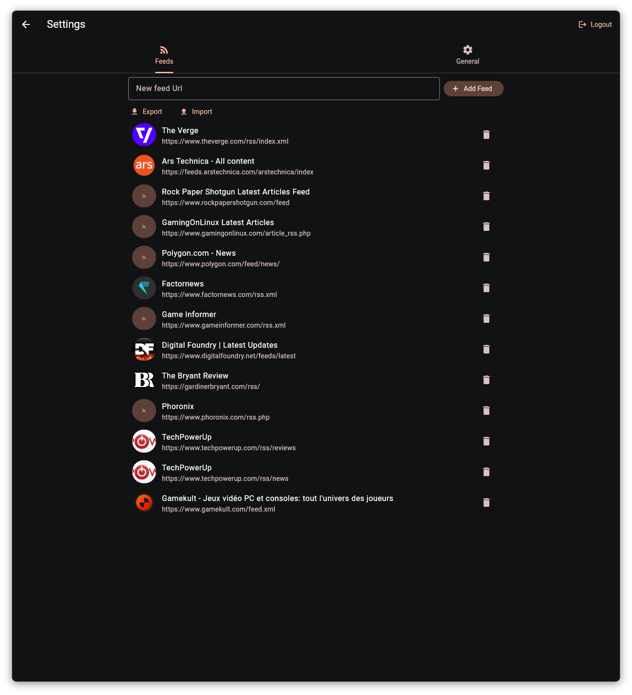

## Set up AI preferences

By default, the AI model will decide what is important news on its own. You can steer its article scoring by setting
your preferences in the "General" tab.

Note that the change will only apply to future articles.

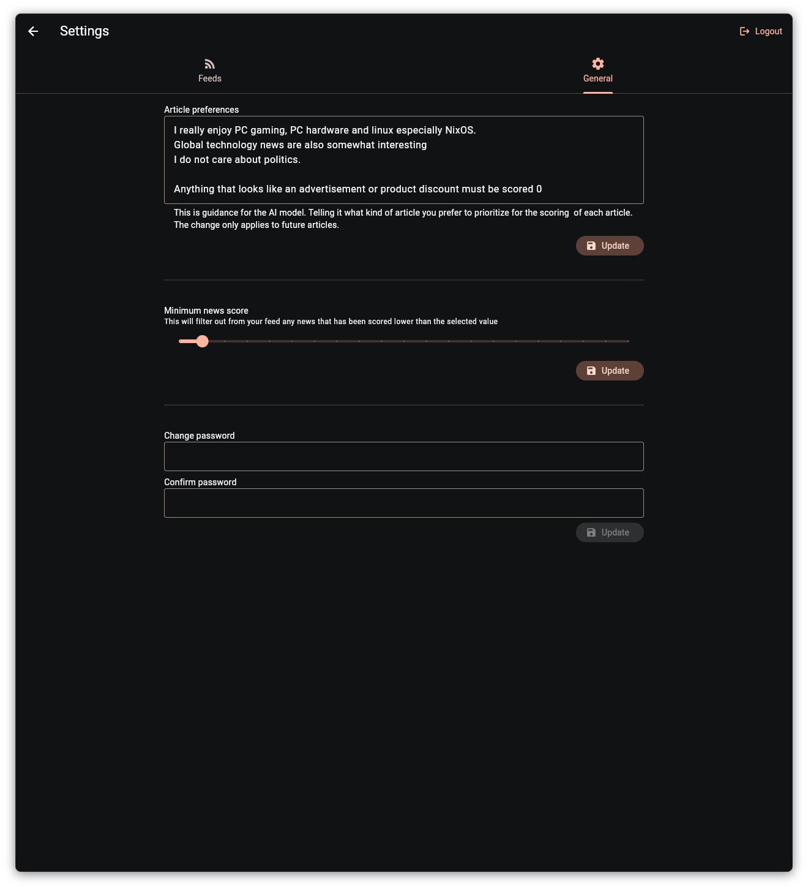

## Customizing layout

With Newsku you can design your home page with building block. Go to Settings > Layout then you can just drag and drop
the blocks as you wish.
The only limit here is that you need to end your layout with a "Dynamic article count" block.

### Block types

| Block type          | Number of articles | Layout builder                                  | In feed                                 | 
|---------------------|--------------------|-------------------------------------------------|-----------------------------------------|
| Headline            | 1                  |          | 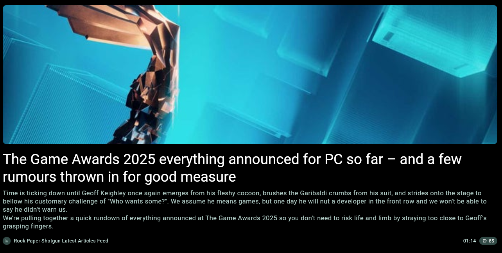         |
| Headline on picture | 1                  |  |  |
| Top stories         | 4                  |       | 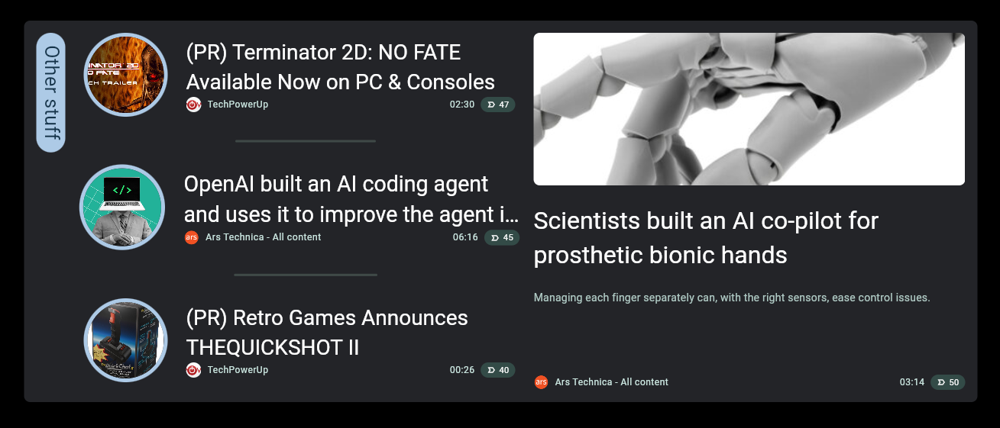      |
| Big grid            | flexible           | 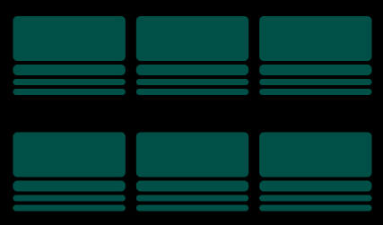         | 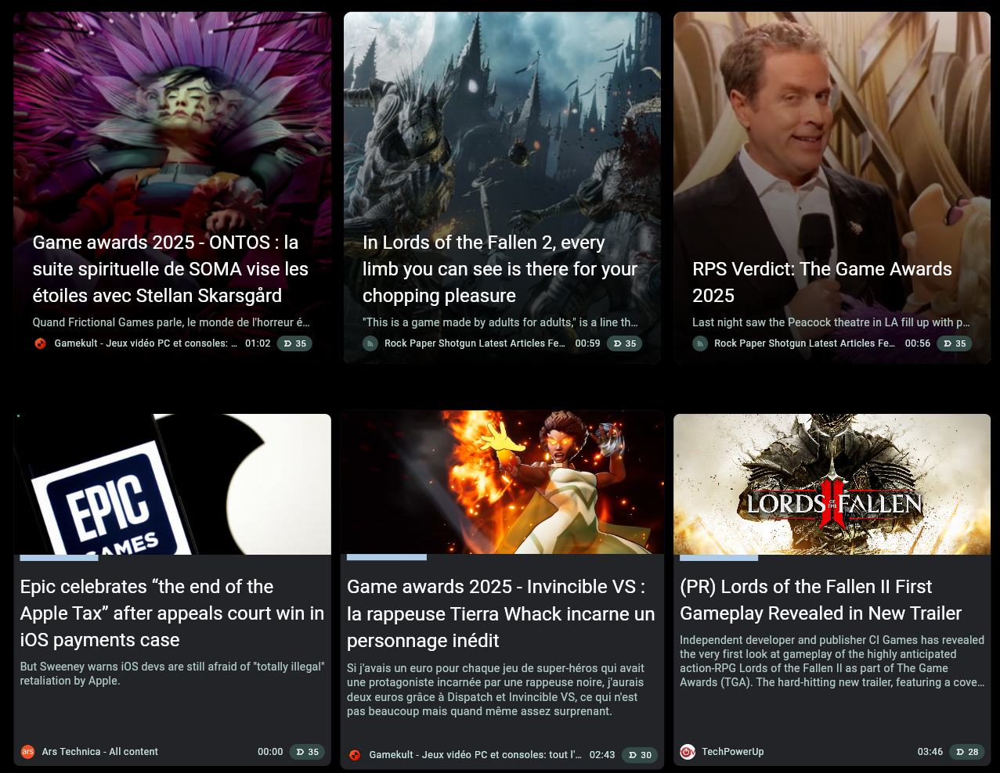         |
| Big picture grid    | flexible           | 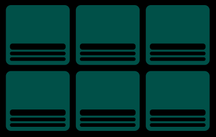 | 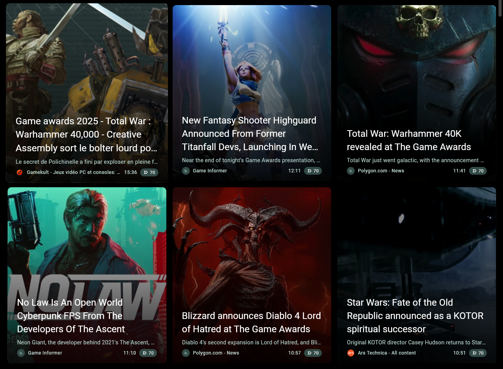 |
| Small grid          | flexible           | 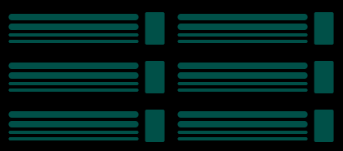       | 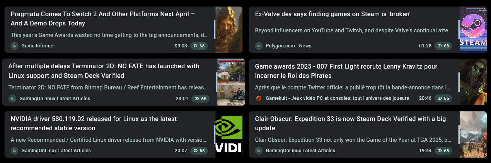       |
| List                | flexible           |   | 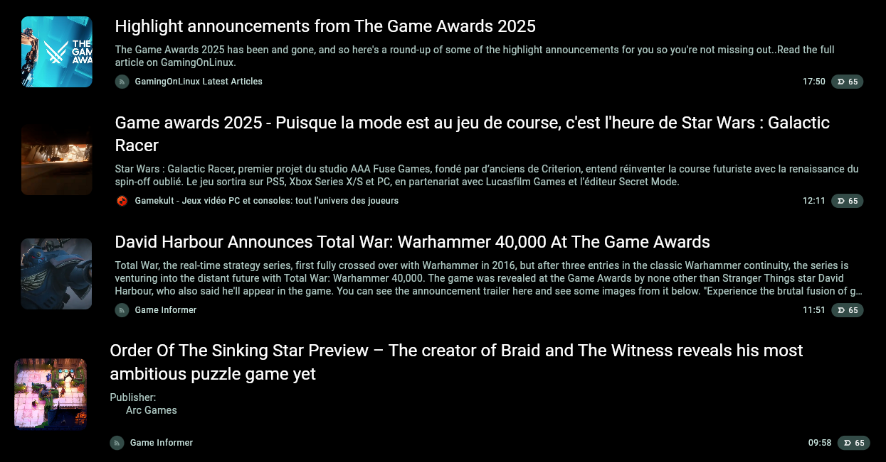  |

