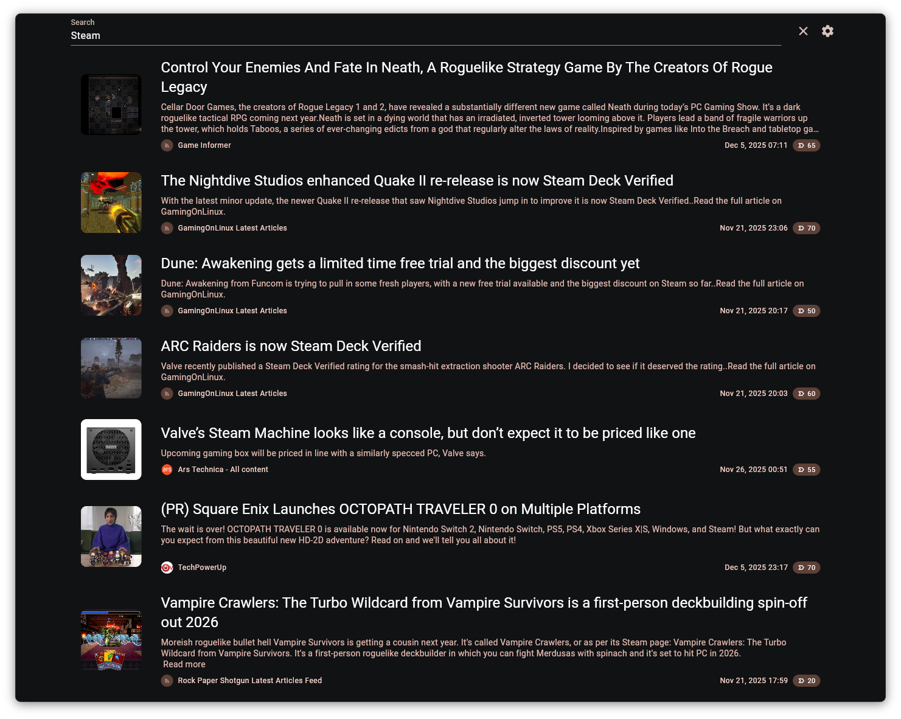
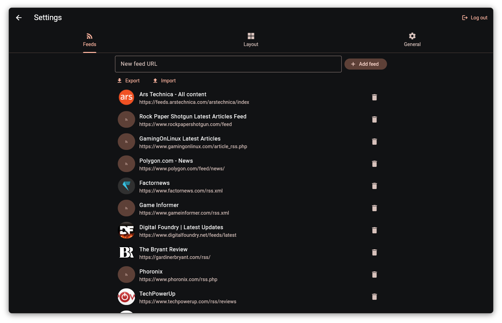
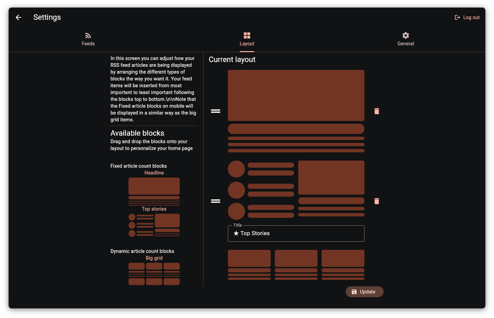

# About Newsku

Newsku is a self-hosted, privacy-first RSS reader that uses LLMs to sort your items by importance based on your
preferences.

## Features

- Sort your RSS feed articles by importance based on your own preference.
- Use natural language to describe the kind of article you prefer or the ones you do not
- Format the front page as a news website
- Can be fully self-hosted and private as it is compatible with OpenAI API for self-hosted server like Llama.cpp.
- Customizable layout

## Screenshot

### Main page

#### Main feed

#### Search

### Settings

#### Feeds

#### Layout customization

