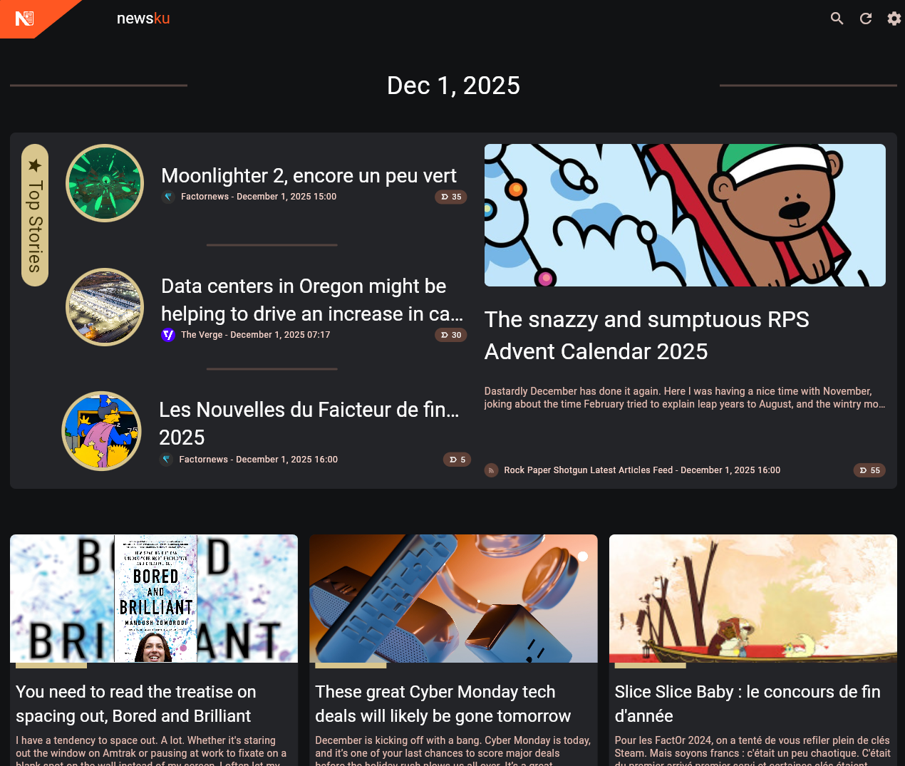

# About Newsku

Newsku is a self-hosted, privacy-first RSS reader that uses LLMs to sort your items by importance based on your
preferences.

## Features

- Sort your RSS feeds articles by importance based on your own preference.
- Use natural language to describe the kind of article you prefer or the ones you do not
- Format the front page as a news website
- Can be fully self-hosted and private as it is compatible with OpenAI api.

### What Newsku is not

Newsku doesn't keep track of the read status of the articles, the main goal is to take all your feeds and create a
personalized news website front page for you

## Screenshot

